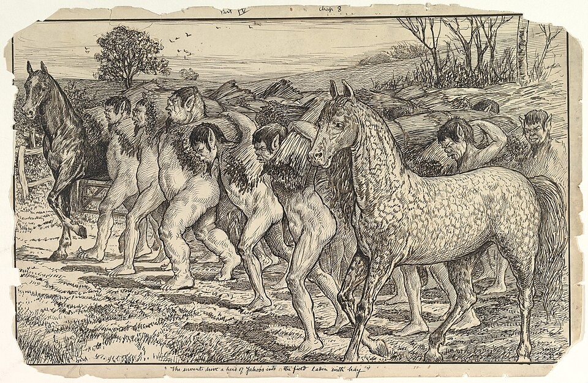

# yahoo-finance

[](https://commons.wikimedia.org/wiki/File:The_Servants_Drive_a_Herd_of_Yahoos_into_the_Field,_from_Gulliver%27s_Travels.jpg)

**[View PDF Documentation](documentation/yahoo-finance.pdf)**

An unofficial Common Lisp client for [Yahoo Finance](https://finance.yahoo.com)
chart data.  This is **not** an official Yahoo product, **not** a port of
Python `yfinance`, and **not** Paul Nathan's archived
[`cl-yahoo-finance`](https://github.com/pnathan/cl-yahoo-finance) (that library
talked to ichart CSV and YQL, both of which are gone).

Yahoo has not offered a supported public Finance API since 2017.  This library
calls the JSON chart endpoint the website itself uses:

```
https://query2.finance.yahoo.com/v8/finance/chart/AAPL
```

No API key.  A browser `User-Agent` is required; without one Yahoo returns 429.

- Github: [cgore/yahoo-finance](https://github.com/cgore/yahoo-finance)

## Install

Clone next to your other local systems (or symlink the `.asd` into
`~/programming/lisp/systems/`):

```lisp
(asdf:load-system :yahoo-finance)
(in-package :yahoo-finance)
```

Depends on `dexador`, `function-cache`, `quri`, `sigma`, and `yason`.

This library does **not** depend on [candlesticks](https://github.com/cgore/candlesticks).
Candlesticks is a Postgres store; this is an HTTP client.  An application
(Livermore, Limbic) can load both and call `ingest-candlesticks`.

## Historical bars

```lisp
;; Daily history, as a list of OHLC-BAR.  Default window is full history
;; via period1/period2, not range=max.
(ohlc-history "AAPL")
(ohlc-bar-close (first *))

;; A named Yahoo range.
(ohlc-history "AAPL" :range "1y")

;; Explicit window.  FROM/TO may be universal times or UNIX seconds.
(ohlc-history "AAPL"
              :from (encode-universal-time 0 0 0 1 1 2020 0)
              :to   (encode-universal-time 0 0 0 1 1 2024 0))

;; Weekly / monthly.  Candlesticks short names "d"/"w"/"M" work too.
(ohlc-history "AAPL" :interval "1wk" :range "5y")
(ohlc-history :msft :interval "w" :range "1y")

;; Second value is what Yahoo said about the series.
(multiple-value-bind (bars meta)
    (ohlc-history "AAPL" :range "1mo")
  (list (length bars)
        (getf meta :currency)              ; "USD"
        (getf meta :full-exchange-name)    ; "NasdaqGS"
        (getf meta :instrument-type)       ; "EQUITY"
        (getf meta :endpoint)))
```

**Do not use `range=max` with a daily interval against the raw endpoint.**
Yahoo ignores `interval=1d` and returns quarterly bars.  `ohlc-history`
rewrites that pair to `period1`/`period2` so you get a real daily series.

Raw payload if you want it:

```lisp
(chart "AAPL" :interval "1d" :range "1y")
(chart-result "AAPL" :range "1y")   ; chart.result[0], or a CHART-ERROR
```

## Feeding candlesticks

```lisp
(ql:quickload '(:yahoo-finance :candlesticks))

(multiple-value-bind (bars meta)
    (yahoo-finance:ohlc-history "AAPL")
  (candlesticks:ingest-candlesticks
   "AAPL" (getf meta :currency) "d"
   (yahoo-finance:ohlc-bars-for-ingest bars)
   :source-name "Yahoo Finance"
   :source-kind "api"
   :endpoint (getf meta :endpoint)
   :numerator-name (or (getf meta :long-name) "Apple")
   :numerator-type "stock"
   :denominator-name "US Dollar"
   :denominator-type "currency"))
```

Mapping Yahoo's `NasdaqGS` / `NMS` onto candlesticks exchange slugs (`nasdaq`)
is the caller's job.

## Testing

Specs are `sigma/behave` `behavior` / `should` forms and run at load time.
`asdf:test-system` reloads the sources so those assertions run again.

```lisp
(asdf:test-system :yahoo-finance)
```

That does not hit the network.  A checked-in 5-day AAPL fixture covers parsing.

To also call Yahoo:

```
YAHOO_FINANCE_LIVE_TESTS=1
```

then `asdf:test-system` again.  Live checks use a short AAPL window.  HTTP 429
is treated as a skip, not a failure.

## License

Yahoo!, Y! Finance, and Yahoo Finance are trademarks of Yahoo, Inc.  This
project is not affiliated with, endorsed, or vetted by Yahoo.

Copyright (c) 2026, Christopher Mark Gore,  
Soli Deo Gloria,  
All rights reserved.

Redistribution and use in source and binary forms, with or without
modification, are permitted provided that the following conditions are met:

* Redistributions of source code must retain the above copyright notice, this list of conditions and the following disclaimer.
* Redistributions in binary form must reproduce the above copyright notice, this list of conditions and the following disclaimer in the documentation and/or other materials provided with the distribution.
* Neither the name of Christopher Mark Gore nor the names of other contributors may be used to endorse or promote products derived from this software without specific prior written permission.

**THIS SOFTWARE IS PROVIDED BY THE COPYRIGHT HOLDERS AND CONTRIBUTORS *"AS IS"* AND ANY EXPRESS OR IMPLIED WARRANTIES, INCLUDING, BUT NOT LIMITED TO, THE IMPLIED WARRANTIES OF MERCHANTABILITY AND FITNESS FOR A PARTICULAR PURPOSE ARE DISCLAIMED. IN NO EVENT SHALL THE COPYRIGHT HOLDER OR CONTRIBUTORS BE LIABLE FOR ANY DIRECT, INDIRECT, INCIDENTAL, SPECIAL, EXEMPLARY, OR CONSEQUENTIAL DAMAGES (INCLUDING, BUT NOT LIMITED TO, PROCUREMENT OF SUBSTITUTE GOODS OR SERVICES; LOSS OF USE, DATA, OR PROFITS; OR BUSINESS INTERRUPTION) HOWEVER CAUSED AND ON ANY THEORY OF LIABILITY, WHETHER IN CONTRACT, STRICT LIABILITY, OR TORT (INCLUDING NEGLIGENCE OR OTHERWISE) ARISING IN ANY WAY OUT OF THE USE OF THIS SOFTWARE, EVEN IF ADVISED OF THE POSSIBILITY OF SUCH DAMAGE.**
